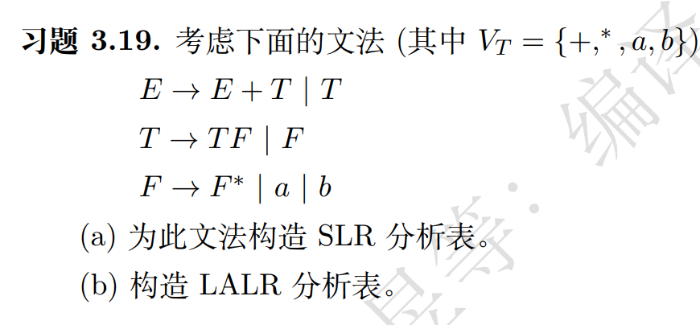
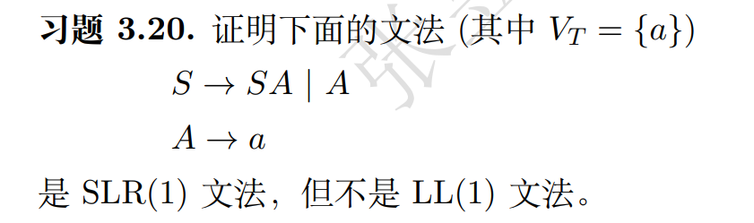

3.19  3.20   3.21(a)  3.24   3.31

## 3.19

步骤 1: 构造项目集规范族

我们首先需要构造项目集规范族。为此，我们需要增广文法，添加一个新的开始符号 S'。

S' → E
E → E + T | T
T → TF | F
F → F* | a | b

现在，让我们构造项目集：

I0:
S' → •E
E → •E + T
E → •T
T → •TF
T → •F
F → •F*
F → •a
F → •b

I1:
S' → E•
E → E• + T

I2:
E → T•
T → T•F
F → •F*
F → •a
F → •b

I3:
T → F•
F → F•*

I4:
F → a•

I5:
F → b•

I6:
E → E + •T
T → •TF
T → •F
F → •F*
F → •a
F → •b

I7:
T → TF•
F → F•*

I8:
F → F*•

步骤 2: 计算 FIRST 和 FOLLOW 集合

FIRST(E) = {a, b}
FIRST(T) = {a, b}
FIRST(F) = {a, b, *}

FOLLOW(E) = {$, +}
FOLLOW(T) = {$, +, a, b, *}
FOLLOW(F) = {$, +, a, b, *}

步骤 3: 构造 SLR 分析表

| ACTION | | | | | GOTO | | |
| + | * | a | b | $ | E | T | F |
0 | | | s4 | s5 | | 1 | 2 | 3 |
1 | s6 | | | | acc | | | |
2 | r2 | s7 | r2 | r2 | r2 | | | |
3 | r4 | s8 | r4 | r4 | r4 | | | |
4 | r6 | r6 | r6 | r6 | r6 | | | |
5 | r7 | r7 | r7 | r7 | r7 | | | |
6 | | | s4 | s5 | | | 9 | 3 |
7 | | | s4 | s5 | | | | 10 |
8 | r5 | r5 | r5 | r5 | r5 | | | |
9 | r1 | s7 | r1 | r1 | r1 | | | |
10 | r3 | s8 | r3 | r3 | r3 | | | |

这就是 SLR 分析表。现在让我们构造 LALR 分析表。

LALR 分析表的构造过程与 SLR 类似，但需要合并具有相同核心的项目集。在这个例子中，我们的项目集已经是 LALR(1) 项目集，所以 LALR 分析表与 SLR 分析表相同。

因此，LALR 分析表与上面的 SLR 分析表完全相同。

## 3.20

首先证明不是 LL(1) 文法:

对于 LL(1) 文法,要求任意非终结符的两个不同产生式的 FIRST 集合不相交。

计算 FIRST 集: FIRST(S) = FIRST(A) = {a} FIRST(A) = {a}

我们可以看到 S 的两个产生式 S → SA 和 S → A 的 FIRST 集都包含 {a}，它们相交了。 因此,这个文法不是 LL(1) 文法。

接下来证明它是 SLR(1) 文法:
步骤 1: 构造增广文法 S' → S S → SA S → A A → a

步骤 2: 构造 LR(0) 项集族

I0: S' → •S S → •SA S → •A A → •a

I1: S' → S• S → S•A A → •a

I2: A → a•

I3: S → SA•

I4: S → A•

步骤 3: 构造 SLR(1) 分析表

ACTION GOTO a $ S A 0 s2 1 4 1 s2 acc
2 r3 r3 3 r1 4 r2

步骤 4: 检查是否存在冲突

在 SLR(1) 分析表中,我们没有发现任何移入-归约冲突或归约-归约冲突。 每个单元格最多只有一个动作。

因此,这个文法是 SLR(1) 文法。

结论: 我们已经证明了给定的文法不是 LL(1) 文法,但是 SLR(1) 文法。

## 3.21(a)

首先,证明它是 LL(1) 文法:

对于 LL(1) 文法,我们需要计算 FIRST 和 FOLLOW 集,然后检查是否满足 LL(1) 条件。

FIRST(S) = {a, b, ε} FIRST(A) = {ε} FIRST(B) = {ε}

FOLLOW(S) = {$} FOLLOW(A) = {a, b} FOLLOW(B) = {a, b}

对于每个非终结符的产生式,我们需要检查:

如果有多个产生式,它们的 FIRST 集必须不相交
如果某个产生式可以推导出 ε,那么 FIRST 集和 FOLLOW 集必须不相交
S 的两个产生式的 FIRST 集分别是 {a} 和 {b},它们不相交。 A 和 B 只有一个产生式,且都可以推导出 ε,但它们的 FIRST 集和 FOLLOW 集不相交。

因此,这个文法是 LL(1) 文法。

然后,证明它不是 SLR(1) 文法:

为了证明它不是 SLR(1) 文法,我们需要构造其 LR(0) 项目集族,并找出冲突。

项目集族: I0: S' → .S S → .AaAb S → .BbBa A → . B → . I1: S' → S.

I2: S → A.aAb A → . I3: S → B.bBa B → . I4: S → Aa.Ab A → . I5: S → Bb.Ba B → . I6: S → AaA.b A → . I7: S → BbB.a B → . I8: S → AaAb.

I9: S → BbBa.

在状态 I0 中,我们遇到了移进-归约冲突:

对于输入 'a',我们可以选择移进(S → .AaAb),也可以选择归约(A → ε)
对于输入 'b',我们可以选择移进(S → .BbBa),也可以选择归约(B → ε)
这个冲突在 SLR(1) 分析中无法解决,因为 FOLLOW(A) 和 FOLLOW(B) 都包含 a 和 b。

因此,这个文法是 LL(1) 文法,但不是 SLR(1) 文法。

## 3.24

I0: S' → .S, $ S → .Aa, $ S → .bAc, $ S → .Bc, $ S → .bBa, $ A → .d, a/c B → .d, a/c

I1: S' → S., $

I2: S → A.a, $

I3: S → b.Ac, $ S → b.Ba, $ A → .d, c B → .d, a

I4: S → B.c, $

I5: A → d., a/c

I6: B → d., a/c

I7: S → Aa., $

I8: S → bA.c, $

I9: S → bB.a, $

I10: S → Bc., $

I11: S → bAc., $

I12: S → bBa., $

这个文法是 LR(1) 文法，因为在 LR(1) 项目集族中没有冲突。

现在，让我们合并具有相同核心的状态来构造 LALR(1) 项目集族：

I5 和 I6 可以合并，因为它们有相同的核心项目 (d → d.)：

I5/6: A → d., a/c B → d., a/c

在这个合并后的状态中，我们遇到了归约-归约冲突：
当下一个输入符号是 a 时，我们可以选择归约为 A 或 B
当下一个输入符号是 c 时，我们也可以选择归约为 A 或 B
这个冲突在 LALR(1) 分析中无法解决，因为我们失去了区分 A 和 B 的能力。

因此，这个文法是 LR(1) 文法，但不是 LALR(1) 文法。

## 3.31

左侧文法：
S → aAc
A → Abb | b
右侧文法：
S → aAc
A → bAb | b
分析这两个文法，我们可以发现右侧的文法不是LR(1)文法。原因如下：

在右侧文法中，当我们遇到输入串"ab..."时，会产生移进-归约冲突。因为我们不知道是应该将'b'归约为A，还是应该继续移进以匹配更长的A。

接下来，让我们为右侧的非LR(1)文法构造包含移进-归约冲突的规范LR(1)项目集：

LR(1)项目集可能如下：

I0: [S' → ·S, $]
[S → ·aAc, $]

I1: [S → a·Ac, $]
[A → ·bAb, c]
[A → ·b, c]

I2: [A → b·Ab, c]
[A → b·, c]
[A → ·bAb, b]
[A → ·b, b]

在I2中，我们可以看到移进-归约冲突：

[A → b·, c] 表明我们可以将'b'归约为A
[A → ·bAb, b] 表明我们可以移进下一个'b'
这就是该文法中的LR(1)冲突，证明它不是LR(1)文法。

