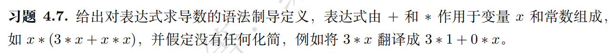
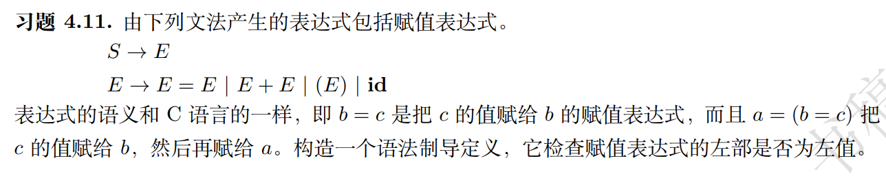
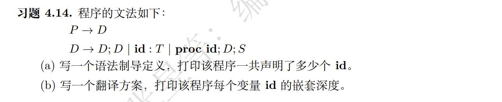

习题 4.7 4.11 4.14

---



给出对表达式求导数的语法制导定义，表达式由 + 和 ∗ 作用于变量 x 和常数组成， 如 x ∗ (3 ∗ x + x ∗ x )，并假定没有任何化简，例如将 3 ∗ x 翻译成 3 ∗ 1 + 0 ∗ x 。

---

假设表达式由非终结符 E 构成，终结符包括加号 +、乘号 \*、变量 x 以及常数 c。

```
E → E + E
  | E * E
  | x
  | c
```

每个非终结符 E 具有两个属性：

E.value：表示该表达式本身。
E.deriv：表示该表达式的导数。

加法运算

```
E → E1 + E2
{
E.val = E1.val + E2.val;
E.deriv = E1.deriv + E2.deriv;
}

```

乘法运算

```

E → E1 _ E2
{
E.val = E1.val _ E2.val;
E.deriv = E1.deriv _ E2.val + E1.val _ E2.deriv;
}

```

变量 x

```

E → x
{
E.val = x;
E.deriv = 1;
}

```

常数 c

```

E → c
{
E.val = c;
E.deriv = 0;
}

```

---



由下列文法产生的表达式包括赋值表达式。
S → E
E → E = E | E + E | (E) | id

表达式的语义和 C 语言的一样，即 b = c 是把 c 的值赋给 b 的赋值表达式，而且 a = ( b = c ) 把 c 的值赋给 b，然后再赋给 a。构造一个语法制导定义，它检查赋值表达式的左部是否左值

---


为了构造一个语法制导定义来检查赋值表达式的左部是否为左值，可以为非终结符 `E` 引入一个属性 `is_lvalue`，用于标识该表达式是否是一个左值。每个 `E` 具有一个属性 `is_lvalue`，表示该表达式是否为左值。

1. **E → id**
     ```
     E.is_lvalue = true
     ```

2. **E → ( E1 )**
     ```
     E.is_lvalue = E1.is_lvalue
     ```

3. **E → E1 + E2**
     ```
     E.is_lvalue = false
     ```

4. **E → E1 = E2**
     ```
     if (E1.is_lvalue) {
         E.is_lvalue = false
     } else {
         语义错误："赋值表达式的左部必须是左值"
     }
     ```


---



程序的文法如下：
P → D
D → D; D | id : T | proc id ; D ; S
(a) 写一个语法制导定义，打印该程序一共声明了多少个 id
(b) 写一个翻译方案，打印该程序每个变量 id 的嵌套深度。

---

### (a) 

为了计算程序中声明的 `id` 的总数，可以为每个非终结符 `D` 添加一个综合属性 `count`

   ```
   P → D
       P.count = D.count

   D → D1 ; D2
       D.count = D1.count + D2.count

   D → id : T
       D.count = 1

   D → proc id ; D' ; S
       D.count = 1 + D'.count
   ```

   - 对于 `D → D1 ; D2`，总数为左边 `D1` 的数量加上右边 `D2` 的数量。
   - 对于 `D → id : T`，每声明一个 `id`，数量加 `1`。
   - 对于 `D → proc id ; D' ; S`，`proc` 声明一个新的 `id`（过程名），数量加 `1`，再加上过程体 `D'` 中的 `id` 数量。


### (b) 

为了跟踪每个 `id` 的嵌套深度，可以使用一个传递属性 `depth` 来表示当前的嵌套层次。每进入一个新的作用域（如 `proc` 声明），`depth` 增加 `1`。

   ```
   P → D
       P.translate(depth=0)

   D → D1 ; D2
       D1.translate(depth)
       D2.translate(depth)

   D → id : T
       D.translate(depth):
           print("id:", id, "depth:", depth)
   
   D → proc id ; D' ; S
       D.translate(depth):
           print("id:", id, "depth:", depth)
           D'.translate(depth + 1)
   ```

   - 初始时，程序 `P` 的 `depth` 设置为 `0`。
   - 对于 `D → D1 ; D2`，保持当前的 `depth` 传递给 `D1` 和 `D2`。
   - 对于 `D → id : T`，打印该 `id` 及其当前的 `depth`。
   - 对于 `D → proc id ; D' ; S`，首先打印 `proc id` 的当前 `depth`，然后在处理过程体 `D'` 时，将 `depth` 增加 `1`。
