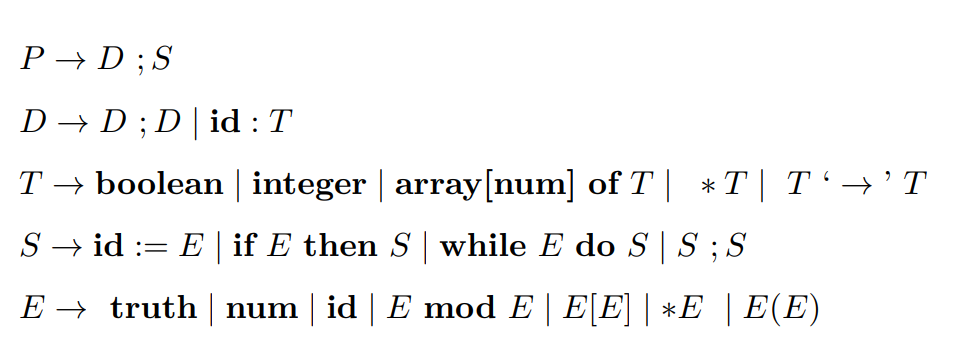

习题 5.6 5.7 5.12 5.14 5.16 5.18 5.22

---

## 5.6

```
习题 5.6. 请写出下面的变量
a 的类型表达式
1) int a[][3];
2) int *a[3];
3) int (*a)[3];
4) int *(*a)[3];
5) int **a[3];
6) int *(*a[3])[2];
```

1. int a[][3];

- a 是一个二维数组，第一维长度未指定，第二维长度为 3
- 类型表达式：array of array[3] of int

2. int \*a[3];

- a 是一个长度为 3 的数组，数组的每个元素是指向 int 的指针
- 类型表达式：array[3] of pointer to int

3. int (\*a)[3];

- a 是一个指针，指向一个长度为 3 的 int 数组
- 类型表达式：pointer to array[3] of int

4. int \*(\*a)[3];

- a 是一个指针，指向一个长度为 3 的数组，该数组的元素是指向 int 的指针
- 类型表达式：pointer to array[3] of pointer to int

5. int \*\*a[3];

- a 是一个长度为 3 的数组，数组的每个元素是指向(指向 int 的指针)的指针
- 类型表达式：array[3] of pointer to pointer to int

6. int \*(\*a[3])[2];

- a 是一个长度为 3 的数组，数组的每个元素是指针，该指针指向一个长度为 2 的数组，数组的元素是指向 int 的指针
- 类型表达式：array[3] of pointer to array[2] of pointer to int

## 5.7

下列文法定义字面常量表的表。符号的解释和 图 5.3 文法的那些相同，增加了类型 list ， 它表示类型 T 的元素表。

```
P → D ; E
D → D ; D | id : T
T → list of T | char | integer
E → ( L ) | literal | num | id
L → E, L | E
```

写一个类似 5.3 节中的翻译方案，以确定表达式 (E ) 和表 (L) 的类型。



## 5.12

```
C 语言是一种类型化语言，但它不是类型可靠的语言，因为运行前的类型检查不能保证所接受的程序没有不会被捕获的错误。例如，编译时的类型检查一般不能保证运行时共用体 （union）中数据的使用不出现类型问题。请你再举一个例子说明 C 语言不是类型可靠的语言。
```

```c
int main() {
    int* p = malloc(sizeof(int));
    *p = 42;

    // 将 int 指针强制转换为 float 指针
    float* fp = (float*)p;

    // 以 float 形式读取实际是 int 的内存
    float f = *fp;  // 这会导致未定义行为

    free(p);
    return 0;
}
```

这说明 C 语言的类型系统不能完全保证程序的类型安全。

## 5.14

```
在文件 stdlib.h 中，关于 qsort 的外部声明如下：

extern void qsort(void ∗, size_t, size_t, int ( ∗)(const void ∗, const void ∗));

下面C 程序所在的文件名是 type.c

1 # include <stdlib.h> 
2 typedef struct{ 
3 int Ave; 
4 double Prob; 
5 }HYPO; 
6 HYPO ∗astHypo; 
7 int n; 
8 int HypoCompare(HYPO ∗stHypo1, HYPO ∗stHypo2) { 
9 if (stHypo1->Prob > stHypo2->Prob){
10 return(-1);
11 }else if (stHypo1->Prob < stHypo2->Prob) {
12 return(1);
13 }else{
14 return(0);
15
}
16 }/∗ end of function HypoCompare ∗/
17 main() {
18 qsort(astHypo, n, sizeof(HYPO), HypoCompare);
19}


用某个C 编译器编译时，错误信息如下：
type.c:18: warning: passing argument 4 of ‘qsort’ from incompatible pointer type
请对该程序略作修改，使得该警告错误能消失，并且不改变程序的结果
```

通过将 HypoCompare 函数的参数类型修改为 const void \*， 并在函数内部将其转换为 const HYPO \* 类型。

HypoCompare 函数的参数类型是 HYPO *，这与 qsort 期望的参数类型不匹配，导致了编译器的警告。


```
#include <stdlib.h> 
typedef struct{ 
    int Ave; 
    double Prob; 
} HYPO; 
HYPO *astHypo; 
int n; 

int HypoCompare(const void *p1, const void *p2) {
    const HYPO *stHypo1 = (const HYPO *)p1;
    const HYPO *stHypo2 = (const HYPO *)p2;
    if (stHypo1->Prob > stHypo2->Prob){
        return -1;
    } else if (stHypo1->Prob < stHypo2->Prob) {
        return 1;
    } else {
        return 0;
    }
} 

int main() {
    qsort(astHypo, n, sizeof(HYPO), HypoCompare);
    return 0;
}
```


## 5.16

```
找出下列表达式的最一般的合一代换。
(a) (pointer ( α )) × ( β → γ )
(b) β × ( γ → δ )
(c) β × ( γ → α )
```

### (a)

1. (pointer ( α )) 表示指针类型，其中 α 是一个类型变量

2. ( β → γ ) 表示函数类型，从 β 类型到 γ 类型的映射

- α 可以是任何类型
- β 可以是任何类型
- γ 可以是任何类型

因此，一般合一代换是：σ = {} (空替换)

### (b)

假设我们需要合一的两个部分是：

1. β
2. γ -> δ

目标是找到一个最一般的代换 σ，使得：

σ(β) = γ -> δ

我们需要将 β 替换为 γ -> δ。

代换 σ = \{ β ↦ γ -> δ \} 是最一般的，因为它直接将 β 替换为所需的函数类型，而不限制 γ 和 δ 的具体类型。

### (c)

表达式为：

β x (γ -> α)

假设这是两个要合一的部分：

1. β
2. γ -> α

目标是找到一个最一般的代换 σ，使得：

σ(β) = γ -> α

为了使 β 等于 γ -> α，需要将 β 替换为 γ -> α。

代换 σ = \{ β ↦ γ -> α \} 是最一般的，因为它直接将 β 替换为所需的函数类型，

## 5.18

```
推导下面 map 的多态类型： 
map: ∀α. ∀β.(( α → β ) × list ( α)) → list ( β ) 
map 的 ML 定义是 
fun map ( f, l ) = if null ( l ) then nil else cons ( f ( hd ( l )), map ( f, tl ( l ))); 
在这个函数体中，内部定义的标识符的类型是： 
null: ∀α.list ( α ) → boolean; 
nil: ∀α.list ( α ) ; 
cons: ∀α. ( α × list ( α)) → list ( α); 
hd: ∀α.list ( α ) → α ; 
tl: ∀α.list ( α ) → list ( α);
```

1) 首先，从函数定义可以看出，map 接受两个参数：f 和 l

2) 设置初始类型变量：
   - 假设输入列表 l 的元素类型为 α
   - f 是从类型 α 到某个类型 β 的函数
   - 所以 f 的类型是 α → β
   - l 的类型是 list(α)

3) 分析函数体：
   if null(l) then nil else cons(f(hd(l)), map(f, tl(l)))

   a) null(l):
      - l 的类型是 list(α)
      - null: list(α) → boolean

   b) nil 分支：
      - nil: list(β)
      - 因为这是返回值之一，所以整个函数的返回类型应该是 list(β)

   c) cons 分支：
      - hd(l): α (因为 l 是 list(α))
      - f(hd(l)): β (因为 f: α → β)
      - tl(l): list(α)
      - 递归调用 map(f, tl(l)): list(β)
      - cons(f(hd(l)), map(f, tl(l))): list(β)

4) 整理类型：
   - 输入: (α → β) × list(α)
   - 输出: list(β)

5) 添加通用量词：
   ∀α.∀β.((α → β) × list(α)) → list(β)

因此，map 的多态类型为：
∀α.∀β.((α → β) × list(α)) → list(β)

## 5.22

```
确定下列哪些表达式有唯一类型（假定 z 是复数）。
(a) 1 ∗ 2 ∗ 3
(b) 1 ∗ (z ∗ 2)
(c) (1 ∗ z ) ∗ z
```

1. 对于表达式 (a): 1 _ 2 _ 3

- 1, 2, 3 都是整数字面量
- 整数之间的乘法是整数

2. 对于表达式 (b): 1 _ (z _ 2)

- z 是复数
- 2 是整数
- z \* 2 的结果是复数
- 1 \* (复数) 的结果是复数

3. 对于表达式 (c): (1 _ z) _ z

- 1 是整数
- 1 \* z 的结果是复数
- (复数) \* z 的结果是复数

(a), (b), (c) 都有唯一类型。
